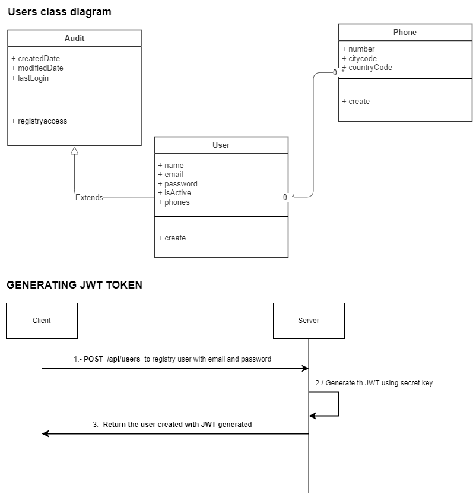

# REST API to register Users, generating a JWTtoken

## Features
* End-point to User registration and generating JWTtoken
*

## Technologies
* Spring Boot 3.0
* Java 17
* Spring JPA
* Spring Security
* H2
* JSON Web Tokens (JWT)
* Maven
* Swagger - springdoc
* lombok library
* Junit

## Getting Started

To build and run the project, follow these steps:

* Clone the repository: `git clone https://github.com/jsandovalz/bci-integration.git`
* Navigate to the project directory: cd bci-integration
* Build the project: mvn clean install
* Run the project: mvn spring-boot:run 

-> The application will be available at http://localhost:8080/api/users

-> The swagger documentation available at http://localhost:8080/swagger-ui.html

